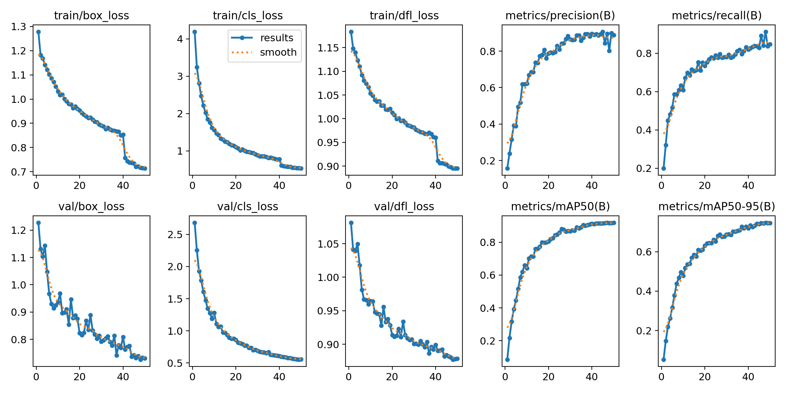
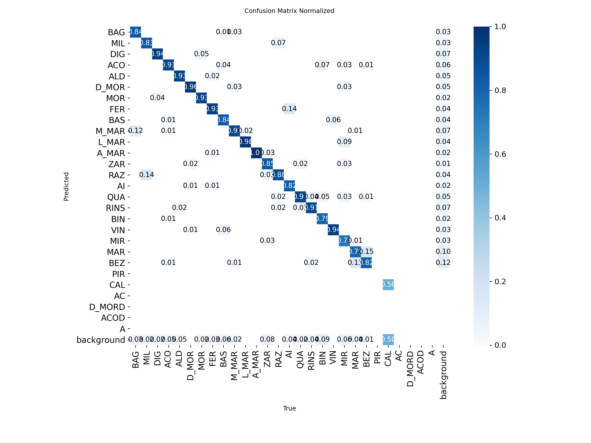

# 🏍️ Real-Time MotoGP Distance Rider Recognition using YOLOv8

An end-to-end Computer Vision project designed to detect and identify MotoGP riders from long-distance shots in real-time. This project features a custom data pipeline including automated video frame division, custom annotation management, dataset rebalancing, and real-time live inference via OBS Virtual Camera.

---

## 📊 Project Performance Overview
Below are the training metrics and confusion matrix proving the model's high generalization capability under extreme track conditions (300+ km/h speeds, high motion blur, and extreme lean angles).

| Training Progress & Loss Curves | Normalized Confusion Matrix |
|:---:|:---:|
|  |  |

*Key Achievement:* Successfully solved the **Class Imbalance** problem between identical team liveries (e.g., Pedro Acosta vs. Brad Binder) through targeted data variance engineering.

---

## 🛠️ Data Pipeline & Utility Scripts
This repository contains custom helper scripts developed to automate and manage the raw dataset before feeding it into the deep learning pipeline:

*   **`divide_frame.py`:** Automatically ingests raw MotoGP broadcast footage and extracts optimized frames per second to prevent overfitting.
*   **`label_count.py`:** Scans `labelme` JSON annotations to calculate class distribution, enabling precise monitoring of class imbalances.
*   **`clear.py`:** Cleans the data pipeline by automatically deleting raw images that lack corresponding annotation files, ensuring a noise-free training environment.
*   **`train.py` (or Notebook):** Contains the training logic executed via Google Colab T4 GPU, utilizing hyperparameter tuning (`degrees=20.0`, `scale=0.5`, `fliplr=0.5`) to handle extreme motion blur and bike rotation.
*   **`obs_catch_video.py`:** Captures real-time stream feeds via OBS Virtual Camera, executing high-speed bounding-box detection with confidence thresholds.
*   **`run.py`:** Captures local video clips, executing high-speed bounding-box detection with confidence thresholds.

---

## 📁 Dataset Management
Due to GitHub's repository size limits, the full **2 GB custom-annotated dataset** (including raw images and Labelme polygon/bounding-box properties) is securely hosted and version-controlled on **Roboflow Universe**.

🔗 **[Access the Full Dataset on Roboflow Here](https://universe.roboflow.com/muhammeds-workspace-a1z98/motogp-driver-detection-2026)**

---

## 🚀 Installation & Quick Start

1. Clone this repository:
```bash
git clone https://github.com/MuhammedYusufOngel/MotoGP-Driver-Detection.git
cd MotoGP-Driver-Detection
